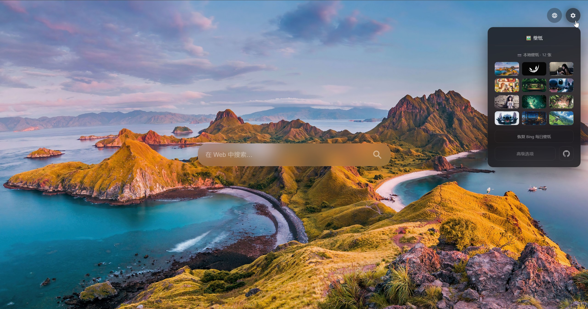
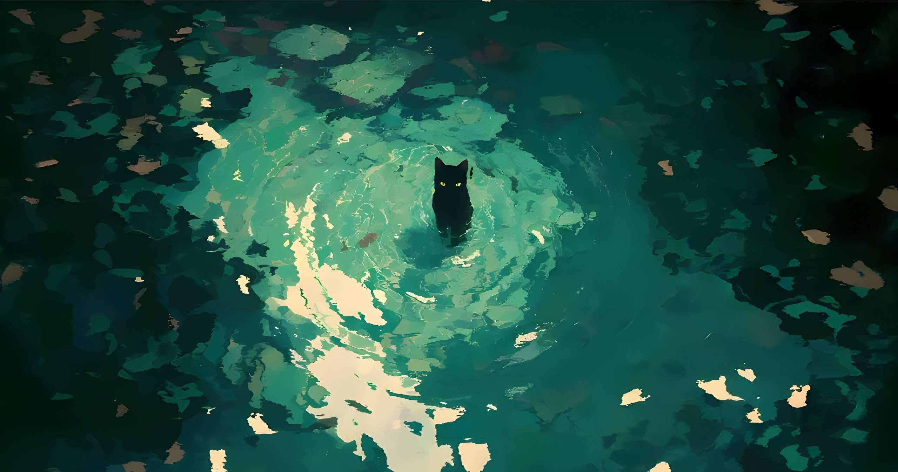
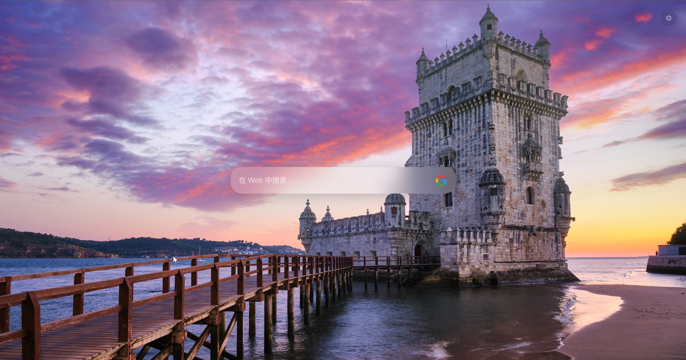
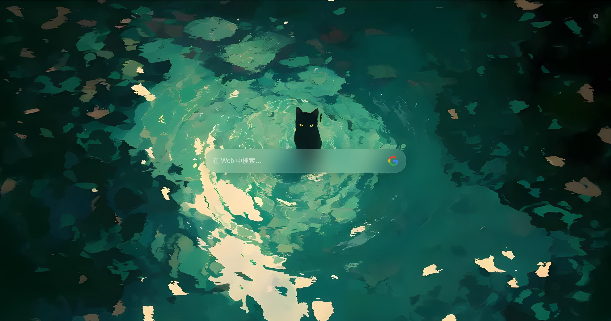
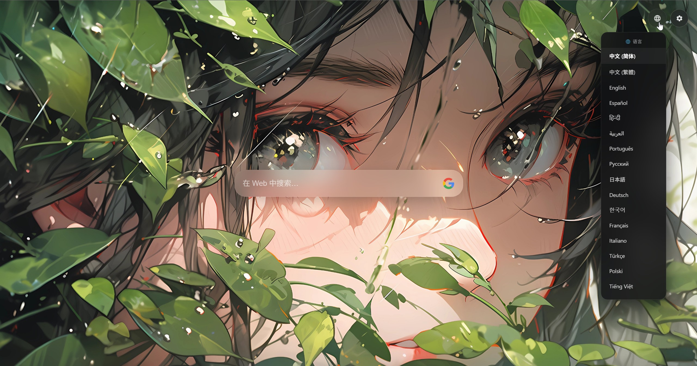
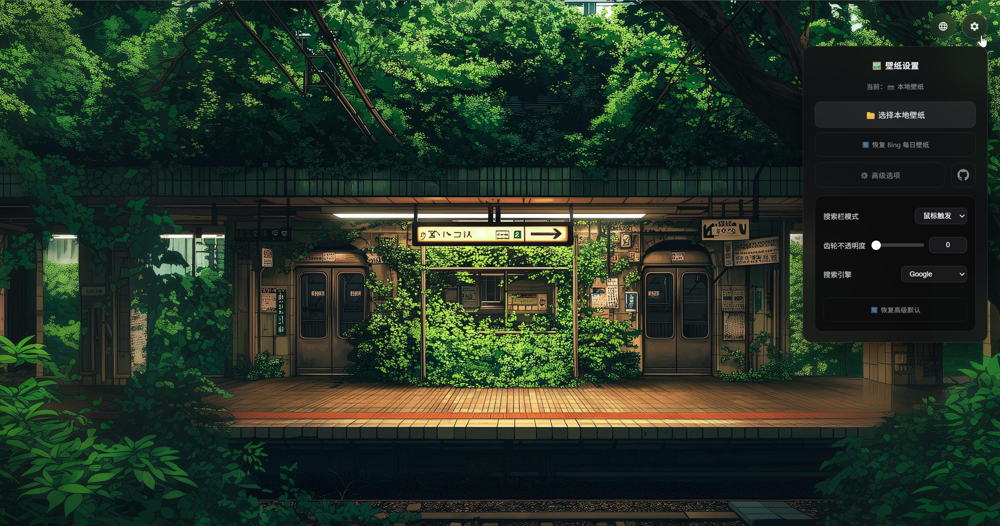
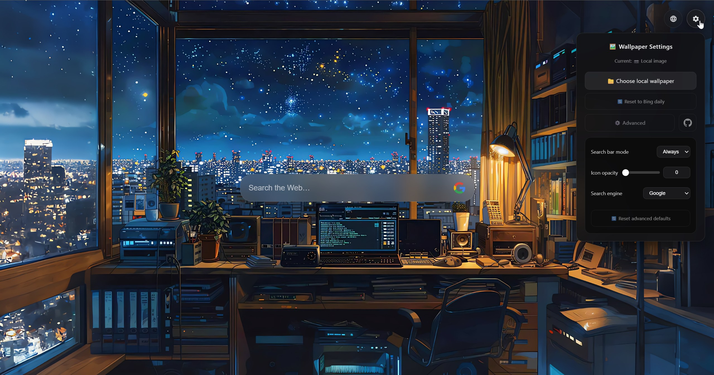
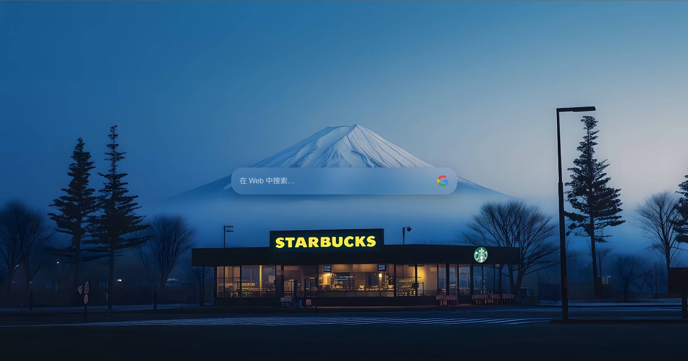

<p align="center">
  
</p>

<h1 align="center">PlainTab · Minimalistyczna strona startowa</h1>

 > Nowa karta powinna robić dobrze tylko jedną rzecz: otworzyć się, pokazać piękną tapetę i wysłać cię do następnej strony. Czy naprawdę potrzebujesz zegara, powitania albo ekranu pełnego skrótów? Odpowiedź PlainTab: maksymalna redukcja, maksymalna prędkość — przywróć swojej nowej karcie jej prawdziwy wygląd: piękny i czysty.

<p align="center">
  <a href="../README.md">English</a> · <a href="README_zh-CN.md">中文 (简体)</a> · <a href="README_zh-TW.md">中文 (繁體)</a> · <a href="README_hi.md">हिन्दी</a> · <a href="README_es.md">Español</a> · <a href="README_ar.md">العربية</a> · <a href="README_fr.md">Français</a> · <a href="README_pt_BR.md">Português</a> · <a href="README_ru.md">Русский</a> · <a href="README_de.md">Deutsch</a> · <a href="README_ja.md">日本語</a> · <a href="README_it.md">Italiano</a> · <a href="README_tr.md">Türkçe</a> · <a href="README_vi.md">Tiếng Việt</a> · <a href="README_ko.md">한국어</a>
</p>

<p align="center">
  
  
  
  <a href="../LICENSE">
    
  </a>
  <a href="https://plaintab.kaininx.workers.dev">
    
  </a>
</p>

<div align="center">
  
  
</div>

<details>
<summary><b>📸 Zobacz więcej zrzutów ekranu</b></summary>
<div align="center">
  
  
  
  
  
  
</div>
</details>

---
Otwarcie nowej karty to natychmiastowa czynność — wciskasz `Ctrl+T` i oczekujesz, że tapeta już tam jest. Aby to osiągnąć, cały design PlainTab koncentruje się na jednym celu: **jak najszybszym wyświetleniu tapety na ekranie**, bez żadnego widocznego procesu ładowania. Dwuwarstwowa architektura tapety, synchroniczne wczytywanie wstępne, potok miniatur Canvas, hybrydowa strategia przechowywania — wszystkie decyzje techniczne zmierzają do tego samego: szybciej, płynniej, bardziej niezauważalnie.

PlainTab jest jednocześnie rozszerzeniem przeglądarki Manifest V3 i niezależną stroną internetową. Zero zewnętrznych zależności, bez procesu budowania, czysty vanilla JS + CSS. Tryb rozszerzenia i tryb Web używają tego samego kodu, automatycznie wykrywając środowisko w czasie wykonania. [Wypróbuj online](https://plaintab.kaininx.workers.dev).

---

## Szybki start

**Rozszerzenie przeglądarki**: zainstaluj z [Chrome Web Store](https://chromewebstore.google.com/detail/plaintab-%C2%B7-minimal-new-ta/jhpfjcefcmooplmaimgdafohdlhacjdo).

**Strona startowa online**: odwiedź [plaintab.kaininx.workers.dev](https://plaintab.kaininx.workers.dev) i ustaw ją jako stronę startową w ustawieniach przeglądarki.

**Uruchomienie lokalne**:

```bash
git clone https://github.com/kaininx/PlainTab.git
```

Załaduj katalog w `chrome://extensions` przez "Załaduj rozpakowane". Bez procesu budowania, bez `npm install`.

<details>
<summary><b>🔧 Jak usunąć szary pasek na dole nowej karty?</b></summary>

Po zainstalowaniu rozszerzenia Chrome / Edge wyświetla stopkę w prawym dolnym rogu nowej karty (z nazwą bieżącego rozszerzenia). To zachowanie przeglądarki, PlainTab nie ma nad tym kontroli w swoim kodzie.

Jak wyłączyć: nowa karta → prawy dolny róg "Dostosuj Chrome" ✏️ → Stopka → wyłącz "Pokaż stopkę na stronie nowej karty". Zobacz [oficjalną pomoc Chrome](https://support.google.com/chrome/answer/11032183?hl=pl).

</details>

---

## Jak szybki jest wallpaper?

PlainTab nie tylko "ładuje obraz" — działa **w trzech skalach czasowych**, z których każda ulepsza doświadczenie w stosunku do poprzedniej:

| Moment | Co się dzieje | Co widzi użytkownik |
|------|-----------|-------------|
| **0ms** (przed pierwszą klatką) | `preload.js` synchronicznie odczytuje miniaturę base64 z localStorage i zapisuje bezpośrednio do `#wallpaperBack.style.backgroundImage` | Tapeta, która już tam jest — nie w HD, ale **absolutnie żaden biały ekran ani szare tło** |
| **~300ms** | `loadWallpaper()` odczytuje zbuforowany Blob z IndexedDB i wyświetla przez Blob URL | Tapeta HD pojawia się, płynnie zastępując miniaturę przez CSS opacity transition |
| **Tylko gdy pamięć podręczna jest nieaktualna** | Żądanie sieciowe do API Bing → pobranie Bloba → wyświetlenie → asynchroniczne buforowanie w IDB | Użytkownik nie zauważa — poprzednia tapeta pozostaje w warstwie back jako zabezpieczenie |

Każda technologia opisana poniżej służy tym trzem momentom — albo skracając czas, albo eliminując widoczne ślady przejść.

---

## Najważniejsze cechy techniczne

### Zero białego ekranu przy pierwszej klatce: podwójna warstwa + synchroniczne wczytywanie wstępne

To najważniejszy element projektu PlainTab. Zanim obraz zostanie załadowany, nowa karta ujawniłaby domyślny kolor tła przeglądarki — zwykle biały ekran lub szare tło. Dwie warstwy `<div>` całkowicie rozwiązują ten problem:

- **[`#wallpaperBack`](../index.html#L14)** (z-index: 0) — zawsze zawiera widoczny obraz. [`preload.js`](../js/preload.js) znajduje się w `<head>` i wykonuje się synchronicznie, zapisując `data:` URL miniatury, zanim przeglądarka wykona pierwsze renderowanie. Ten krok jest synchroniczny — nie przechodzi przez żadne asynchroniczne API, nie czeka na sieć. W trybie rotacji wielu obrazów wie nawet, którego indeksu miniatury użyć w danym momencie.
- **[`#wallpaperFront`](../index.html#L16)** (z-index: 1, `opacity: 0`) — używany do płynnych przejść. Nowy obraz jest wstępnie dekodowany w pamięci przez [`Image.decode()`](https://developer.mozilla.org/docs/Web/API/HTMLImageElement/decode) → ustawiany jako tło warstwy przedniej → płynne przejście CSS [`opacity` transition](https://developer.mozilla.org/docs/Web/CSS/transition) → po zakończeniu przejścia stabilizowany do warstwy back → front wraca do przezroczystości.

Podstawowa zasada: **w każdej chwili co najmniej jedna warstwa zawiera wyrenderowany obraz**. Warstwa back zawsze ma coś do pokazania; warstwa front pojawia się tylko na krótko podczas przejścia. Nawet jeśli użytkownik ogląda klatka po klatce, nie zobaczy pustej chwili.

### Od wejścia do piksela: dlaczego miniatura zamiast oryginalnego obrazu?

`preload.js` nie może czekać na asynchroniczne ładowanie — straciłby pierwszą klatkę. Ale oryginalny obraz w IndexedDB jest asynchroniczny, a ciąg base64 o wielkości kilku MB nie zmieści się w localStorage (ograniczony limit). Dlatego PlainTab, po wyświetleniu poprzedniej tapety, **robi krok dalej**: używa Canvas do zmniejszenia obrazu do JPEG o szerokości 640px, jakości 0,55, kompresji zwykle 30–60 KB, bezpiecznie zapisując go w localStorage. Przy następnym otwarciu nowej karty `preload.js` pobiera go i używa bezpośrednio.

640px jest wystarczająco ostre na ekranie 2K, aby nie wyglądać jak miniatura — a za te kilkanaście KB stoi precyzyjne skalowanie [Canvas API](https://developer.mozilla.org/docs/Web/API/Canvas_API) w połączeniu z regulacją jakości [`toDataURL('image/jpeg', 0.55)`](https://developer.mozilla.org/docs/Web/API/HTMLCanvasElement/toDataURL). Ta miniatura jest również źródłem danych do renderowania siatki 3×4 w galerii — wygenerowana raz, wykorzystana w dwóch miejscach.

### Podwójny `requestAnimationFrame` sterujący przejściami CSS

Przejście z miniatury do obrazu HD musi wywołać transition CSS. Ale obliczanie stylów i renderowanie przeglądarki są asynchroniczne — jeśli dodasz klasę zaraz po ustawieniu `backgroundImage`, przeglądarka może przetworzyć oba stany w tym samym renderowaniu klatki, a animacja przejścia nie zostanie uruchomiona.

```javascript
requestAnimationFrame(function () {
    requestAnimationFrame(function () {
        front.classList.add('active');
    });
});
```

Pierwszy [`requestAnimationFrame`](https://developer.mozilla.org/docs/Web/API/Window/requestAnimationFrame) zapewnia, że `backgroundImage` został obliczony; drugi gwarantuje, że style zostały przesłane do potoku renderowania. Dopiero wtedy dodanie klasy powoduje, że przeglądarka widzi zmianę "stary styl → nowy styl" i uruchamia prawidłowe przejście. Przy jednym pominiętym przejście jest pomijane — użytkownik widzi twardą zmianę zamiast płynnego zanikania.

### Dlaczego IndexedDB i localStorage współistnieją?

Te dwa sposoby przechowywania nie są alternatywą, ale podziałem obowiązków:

| Przechowywanie | Co zawiera | Dlaczego tutaj |
|------|--------|---------------|
| **[IndexedDB](https://developer.mozilla.org/docs/Web/API/IndexedDB_API)** | Oryginalne Bloby (codzienna tapeta Bing, lokalne obrazy przesłane przez użytkownika) | Duże pliki wymagają dużego limitu; asynchroniczny odczyt/zapis jest w pełni akceptowalny poza ścieżką pierwszej klatki |
| **[localStorage](https://developer.mozilla.org/docs/Web/API/Window/localStorage)** | `data:` URL miniatur, preferencje UI, metadane, indeks rotacji | **Synchroniczny odczyt** — to jest kluczowe. `preload.js` działa przed pierwszą klatką i nie może czekać na żadne asynchroniczne wywołanie zwrotne |

Połączenie IDB jest buforowane jako singleton, z automatycznym odtworzeniem przy `onclose`. Bloby pobrane z IDB mogą stracić typ MIME — pole `mime` jest zawsze zapisywane podczas przechowywania, a przy pobieraniu odtwarzane za pomocą `new Blob([blob], {type: img.mime})`, aby zapewnić poprawne renderowanie Blob URL.

### Samonaprawa miniatur

`saveLocalImage()` zapisuje najpierw do IDB (blob), potem do localStorage (miniatura). Te dwa kroki nie są atomową transakcją — jeśli strona ulegnie awarii dokładnie między nimi, tablica miniatur będzie o jeden element krótsza niż tablica obrazów. PlainTab nie przeprowadza globalnego samosprawdzenia przy starcie (co maskowałoby poważniejsze niespójności danych), ale **regeneruje miniaturę na bieżąco, gdy rotacja trafi na obraz z brakującą miniaturą**. Naprawa następuje tylko wtedy, gdy obie tablice mają tę samą długość — niezgodność długości oznacza nieznany wyjątek zapisu, a pominięcie jest bezpieczniejszym wyborem.

### Cykl życia Blob URL

Wszystkie Blob URL utworzone przez [`URL.createObjectURL()`](https://developer.mozilla.org/docs/Web/API/URL/createObjectURL) w galerii są śledzone w tablicy i zbiorczo odwoływane przy zamknięciu galerii przez [`URL.revokeObjectURL()`](https://developer.mozilla.org/docs/Web/API/URL/revokeObjectURL). Jednak ta ścieżka jest fallbackiem — **preferowane jest używanie wstępnie wygenerowanych miniatur base64**, ponieważ base64 nie wymaga tworzenia/odwoływania Blob URL, a renderowanie jest szybsze.

### Właściwości niestandardowe CSS dla tematu runtime

Przezroczystość ikon (`--icon-opacity`) jest kontrolowana przez zmianę [niestandardowej właściwości CSS](https://developer.mozilla.org/docs/Web/CSS/--*) za pomocą JS, jednolicie sterując wszystkimi przyciskami narożnymi i panelami — jedno `setProperty`, a przeglądarka automatycznie aktualizuje wszystkie elementy odwołujące się do tej zmiennej. Tokeny projektowe (`--glass-bg`, `--glass-border`, `--text-primary` itd.) są zdefiniowane na [`:root`](https://developer.mozilla.org/docs/Web/CSS/:root), a motyw ciemny/jasny jest przełączany przez media query [`prefers-color-scheme`](https://developer.mozilla.org/docs/Web/CSS/@media/prefers-color-scheme).

### Panele z efektem szkła

Panele ustawień i języka używają [`backdrop-filter: blur()`](https://developer.mozilla.org/docs/Web/CSS/backdrop-filter) do rozmycia treści tapety **za** panelem — a nie taniego rozwiązania z półprzezroczystą maską. W połączeniu z `--glass-bg: rgba(18, 18, 22, 0.82)` tworzy prawdziwe wrażenie głębi.

### Interfejs wrażliwy na pozycję myszy

Przyciski narożne i pasek wyszukiwania pojawiają się tylko wtedy, gdy są potrzebne — `isNearTopRight()` i `isInCenter()` to dwie funkcje matematyczne określające pozycję myszy, bez potrzeby wiązania `mouseenter`/`mouseleave` na pełnoekranowej warstwie tła. Ukrywanie jest opóźnione (przyciski 400ms, pasek wyszukiwania 150ms) i pomijane, gdy panel jest otwarty lub pole wprowadzania jest aktywne. Każda ścieżka interakcji jest jak najkrótsza: **pojawienie się szybkie, zniknięcie stabilne**, bez przerywania użytkownikowi fałszywymi wyzwoleniami.

### Szeregowy łańcuch Promise dla wsadowego przesyłania

Użytkownicy mogą wybrać wiele lokalnych tapet jednocześnie. Każde `saveLocalImage()` odczytuje i zapisuje IDB — równoległe wykonanie spowodowałoby wyścigi danych. Przesyłanie wsadowe używa łańcucha Promise do serializacji wszystkich operacji zapisu, zapisując jeden obraz na raz. Pierwszy pomyślnie zapisany obraz jest wyświetlany jako tapeta, pozostałe są tylko archiwizowane. Dzięki temu użytkownik nie widzi migotania spowodowanego ciągłym przełączaniem obrazów.

### `chrome.search.query()` dla zgodności z CWS

W trybie rozszerzenia [`chrome.search.query()`](https://developer.mozilla.org/docs/Mozilla/Add-ons/WebExtensions/API/search/query) deleguje wyszukiwanie do domyślnej wyszukiwarki przeglądarki — wymóg zgodności z polityką single-purpose Chrome Web Store. Selektor wyszukiwarki jest ukryty w DOM, a ikona staje się statyczną lupą.

---

## Technologie użyte do eliminacji opóźnień

PlainTab nie używa żadnych frameworków ani bibliotek. Każde z poniższych API zostało wybrane, aby **zaoszczędzić jedno asynchroniczne oczekiwanie, wyeliminować jedno widoczne migotanie, zredukować jedno opóźnienie klatki**:

- **[`Image.decode()`](https://developer.mozilla.org/docs/Web/API/HTMLImageElement/decode)** — asynchroniczne dekodowanie przed ustawieniem `backgroundImage`, oszczędzające pauzę dekodowania podczas renderowania pierwszej klatki. Załadowanie `` nie oznacza zakończenia dekodowania; bez wywołania `decode()` przy pierwszym rysowaniu może pojawić się krótka pusta klatka
- **[`backdrop-filter`](https://developer.mozilla.org/docs/Web/CSS/backdrop-filter)** — używa rozmycia komponowanego przez GPU zamiast dodatkowych warstw DOM i obrazów maskujących, zero dodatkowego narzutu na układ
- **[`<meta name="darkreader-lock">`](https://github.com/darkreader/darkreader/blob/main/tips/website-lock-meta-tag.md)** — blokuje Dark Readera, zapobiegając odwracaniu kolorów tapety przez jego filtry — tapeta sama w sobie jest treścią wizualną, a filtrowanie zniweczyłoby wysiłki wierności potoku miniatur Canvas
- **[`color-scheme: dark light`](https://developer.mozilla.org/docs/Web/CSS/color-scheme)** — jedna deklaracja sprawia, że przeglądarka automatycznie dostosowuje kolory formularzy, pasków przewijania i elementów systemowych, bez potrzeby pisania dwóch zestawów stylów nadpisujących
- **[`cubic-bezier(0.4, 0, 0.2, 1)`](https://developer.mozilla.org/docs/Web/CSS/easing-function#cubic-bezier)** — ujednolicona krzywa easing dla wszystkich animacji pojawiania się i zanikania. To nie `ease` ani `ease-in-out` — ta krzywa szybciej osiąga cel na początku i ma łagodniejsze wygaszanie na końcu. Dla odpowiedzi UI rzędu milisekund różnica percepcyjna jest wyraźna
- **[`chrome.i18n.getUILanguage()`](https://developer.mozilla.org/docs/Mozilla/Add-ons/WebExtensions/API/i18n/getUILanguage)** — w trybie rozszerzenia pobiera język interfejsu przeglądarki, dokładniej odzwierciedlając rzeczywiste preferencje użytkownika niż `navigator.language`
- **[`requestAnimationFrame`](https://developer.mozilla.org/docs/Web/API/Window/requestAnimationFrame)** — nie opiera się na `setTimeout` w odgadywaniu momentu renderowania, ale precyzyjnie dostosowuje się do rytmu klatek przeglądarki. Dwukrotne użycie zapewnia wyraźną granicę klatki między obliczaniem stylów a ich wysyłką
- **[`Promise.any()`](https://developer.mozilla.org/docs/Web/JavaScript/Reference/Global_Objects/Promise/any)** — Uruchamia oba punkty końcowe API Bing jednocześnie i używa tego, który odpowie pierwszy, eliminując niepotrzebne oczekiwanie
- **[`AbortController`](https://developer.mozilla.org/docs/Web/API/AbortController)** — Ogranicza każde żądanie API Bing do 8 sekund, czysto przerywając przegrywające połączenie zamiast pozostawiać je do czasu TCP na poziomie systemu operacyjnego

**Równie ważne są technologie, których nie użyto**: zero zewnętrznych zależności. Żadnego Reacta, Tailwinda ani narzędzi do budowania. CSP w `manifest.json` ogranicza `script-src 'self'` — przeglądarka wymusza czysty vanilla JS. Każda niewprowadzona biblioteka oznacza mniej czasu na parsowanie, mniejszy narzut sieciowy i wcześniejszą pierwszą klatkę.

**Stack czcionek**: `-apple-system, BlinkMacSystemFont, 'Segoe UI', 'PingFang SC', 'Microsoft YaHei', sans-serif` — natywne czcionki systemu operacyjnego, zero żądań sieciowych, zero przesunięć układu. Pliki czcionek są zwykle jednym z największych blokujących zasobów strony; PlainTab omija cały ten problem.

---

## Dwa tryby działania

Ten sam kod, automatyczne wykrywanie środowiska w czasie wykonania:

| Cecha | Tryb rozszerzenia | Tryb Web |
|------|----------|----------|
| Wykrywanie środowiska | `chrome.runtime.id` istnieje | Wszystkie inne przypadki |
| Wyszukiwarka | Domyślna przeglądarki (`chrome.search.query`) | Google / Bing / Baidu / DuckDuckGo do wyboru |
| Przełączanie wyszukiwarki | Niemożliwe (statyczna lupa) | Kliknięcie ikony zmienia cyklicznie |
| Wdrożenie | Chrome Web Store / ładowanie deweloperskie | Cloudflare Workers / GitHub Pages bezpośrednie hostowanie |
| CSP | Zadeklarowane w `manifest.json` | CSP nie jest potrzebne |

---

## Priorytet ładowania tapety

Przy każdym otwarciu nowej karty wyszukiwane jest najszybsze dostępne źródło tapety w następującej kolejności:

1. **Rotacja lokalnych tapet** — własne obrazy użytkownika (maks. 12), Blob już w IDB, pobranie bezpośrednie. Miniatura już wstępnie wygenerowana. Zero narzutu sieciowego.
2. **Dzisiejsza pamięć podręczna Bing** — tapeta Bing już pobrana dzisiaj, Blob w IDB, bezpośrednio konwertowany do Blob URL i wyświetlany. Zero narzutu sieciowego.
3. **Pobranie Bing z sieci** — tylko gdy dwa poprzednie poziomy są niedostępne, następuje połączenie sieciowe. Po uzyskaniu URL obraz jest natychmiast wyświetlany, a Blob jest asynchronicznie pobierany i zapisywany w IDB, aby przy następnym razie uniknąć oczekiwania sieciowego.

W trybie lokalnych tapet tapeta Bing jest wciąż po cichu aktualizowana w tle — użytkownik może w każdej chwili przełączyć się na tryb Bing bez czekania na sieć.

API Bing uruchamia oba punkty końcowe jednocześnie przez `Promise.any` z 8-sekundowym limitem czasu przez `AbortController` — najszybsza odpowiedź wygrywa. Ładunki JSON są niewielkie, więc dodatkowe żądanie kosztuje praktycznie nic, a jednak wyścig zapewnia optymalne opóźnienie niezależnie od tego, gdzie jesteś. Kody językowe (np. `zh-CN`) są mapowane na kody rynkowe Bing, a niektóre języki wracają do `en-US`.

---

## Internacjonalizacja

Obsługa 16 języków: 简体中文、繁體中文、English、日本語、한국어、Español、Русский、Deutsch、Français、Italiano、Português、हिन्दी、العربية、Türkçe、Polski、Tiếng Việt.

Dwa równoległe systemy i18n: Chrome `_locales/` odpowiada za metadane manifestu rozszerzenia (tylko dwa klucze: `extName`, `extDesc`), a [`languages.js`](../js/languages.js) za wszystkie ciągi UI. Priorytet wykrywania języka: język interfejsu Chrome (tryb rozszerzenia) → `navigator.language` (tryb Web) → dopasowanie głównego języka → fallback do angielskiego.

Niedoskonałe tłumaczenie lub chcesz dodać nowy język? Plik językowy to jeden plik [`js/languages.js`](../js/languages.js), czysta mapa klucz-wartość. Po edycji wyślij PR.

---

## Struktura projektu

```
PlainTab/
├── manifest.json            # Manifest rozszerzenia Chrome/Edge (Manifest V3)
├── index.html               # Jedyna strona HTML (nowa karta rozszerzenia / strona główna Web)
├── 404.html                 # Strona zapasowa SPA
├── LICENSE                  # Licencja MIT
│
├── css/
│   └── newtab.css           # Wszystkie style: dwuwarstwowa tapeta, panele szklane, pasek wyszukiwania, responsywność
│
├── js/
│   ├── preload.js           # Synchroniczne IIFE: wstrzykuje miniaturę do warstwy back przed pierwszą klatką
│   ├── languages.js         # Tabela ciągów UI dla 16 języków + lista języków
│   └── newtab.js            # Główny program: zarządzanie tapetą, i18n, przechowywanie, UI, wyszukiwarka
│
├── _locales/                # i18n Chrome (16 katalogów językowych, tylko do manifestu rozszerzenia)
│   ├── en/messages.json
│   ├── zh_CN/messages.json
│   └── ...
│
├── icon/                    # Ikony rozszerzenia (16/48/128/2048 px)
│
├── imgs/                    # Zrzuty ekranu i obrazy promocyjne
│   ├── chrome_01.jpg ~ chrome_08.jpg  # Zrzuty ekranu funkcji
│   └── small_promo.png      # Mały obraz promocyjny Chrome Web Store
│
├── docs/                    # Wielojęzyczne README (16 języków) + CHANGELOG
│
└── changelog/               # Dzienniki zmian dla każdego języka
```

- **[`css/`](../css/)** — pojedynczy plik ~617 linii, motyw ciemny/jasny, tokeny projektu szkła, responsywny breakpoint 480px
- **[`js/`](../js/)** — trzy pliki ładowane w kolejności: `preload.js` → `languages.js` → `newtab.js` (kolejność nie może być zmieniona)
- **[`_locales/`](../_locales/)** — zawiera tylko `extName` i `extDesc` dla manifestu rozszerzenia; wszystkie ciągi UI są zarządzane przez [`languages.js`](../js/languages.js)
- **[`imgs/`](../imgs/)** — zrzuty ekranu i obrazy promocyjne wymagane przez Chrome Web Store
- **[`docs/`](../docs/)** — wielojęzyczna dokumentacja, osobne pliki dla każdego z 16 języków

---

## Współpraca i licencja

Open source na licencji MIT. Znalazłeś błąd lub masz pomysł? → [Zgłoś Issue](https://github.com/kaininx/PlainTab/issues). Chcesz zmienić kod? → Fork + PR.

Kilka zasad:
- **Zachowaj zero zależności** — nie dodawaj paczek npm, skryptów CDN ani frameworków
- **Nie dodawaj etapów budowania** — `index.html` musi działać bezpośrednio w przeglądarce
- **Nie rozszerzaj uprawnień** — `manifest.json` zachowuje tylko uprawnienie `search`

📋 [Dziennik zmian](changelog.md)

---

## Podziękowania

- Obrazy codziennej tapety Bing pochodzą z [Bing](https://www.bing.com), podziękowania dla zespołu Microsoft Bing za wieloletnie dostarczanie wysokiej jakości zdjęć każdego dnia
- Proxy API: [bing.biturl.top](https://bing.biturl.top) (publiczne proxy) i [bing.kaininx.workers.dev](https://bing.kaininx.workers.dev) (zapasowy Cloudflare Worker)
- Tapety widoczne na zrzutach ekranu pochodzą od różnych twórców w sieci

MIT · [Kaelri](https://github.com/kaininx)
